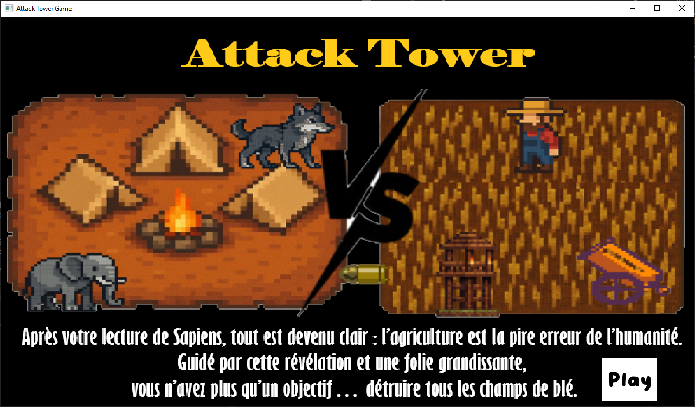
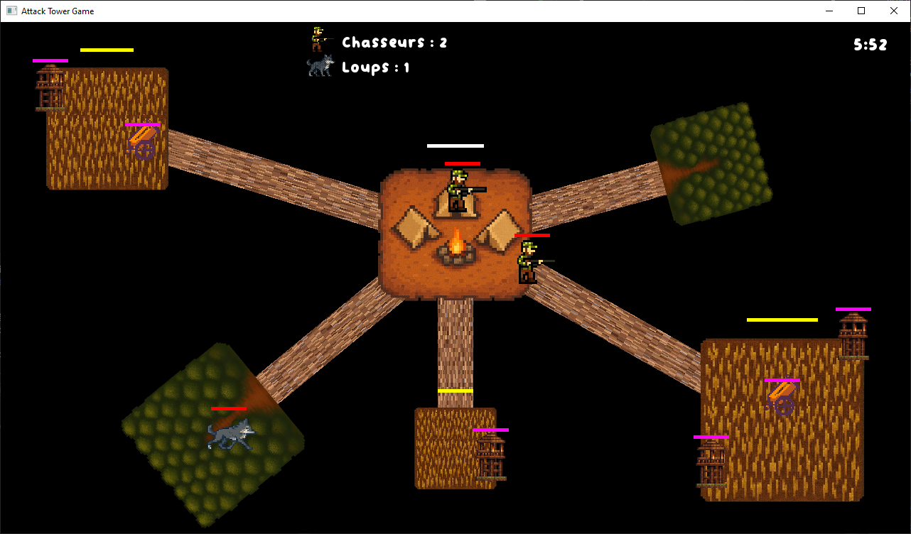

Description du jeu : 

Après votre lecture de Sapiens, tout est devenu clair : l'agriculture est la pire erreur de l'humanité.
Guidé par cette révélation et une folie grandissante, vous n'avez plus qu'un objectif... détruire tous les champs de blé !

Vous levez donc une armée afin d'accomplir votre dessein.
Il existe 3 différents types de troupes dans votre armée :
- Le chasseur : vitesse moyenne, pv moyens, dégâts moyens
- Le loup : vitesse élevée, pv faibles, dégâts moyens
- l'éléphant : vitesse faible, pv très élevés, dégâts élevés

Une troupe peut : 
- Aller dans une forêt pour produire une nouvelle troupe du même type qu'elle
- Aller dans un champ pour attaquer d'abord les défenses du champ puis le champs lui-même
- Aller à la base de l'armée pour la protéger

Vous gagnez la partie si vous arrivez à détruire tous les champs dans le temps imparti.
Vous perdez si votre base est détruite ou si le temps imparti est écoulé.

Bon courage pour sauver le monde de l'agriculture !

Mode d'emploi : 

1. Clic gauche de la souris sur une troupe pour la sélectionner
2. Puis clic gauche sur un lieu pour dire à la troupe sélectionnée d'y aller

Images : 
)
)

Comment génerer le code : 
Suivre la procédure "Construire un projet C++ avec CMake" : 
https://www-inf.telecom-sudparis.eu/COURS/CSC4526/new_site/Supports/Documents/OutilsCSC4526/outilsCSC4526.html#construire-un-projet-c-avec-cmake

Remarques : 
- Les images et sprites ont été générés par IA
- Le code est écrit en C++ et utilise les bibliothèque SFML pour l'affichage graphique et pugixml pour la gestion de la map

Développeurs et Game Designers : 
- Héloïse Havy
- Sophie Siniavski